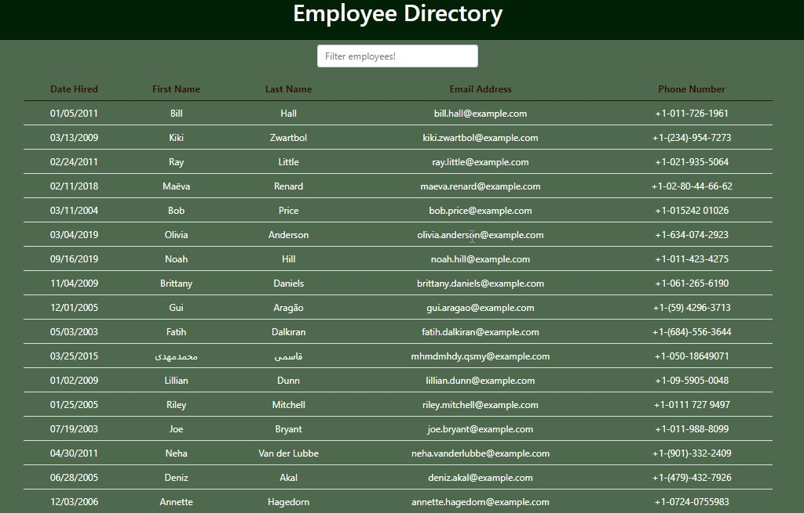
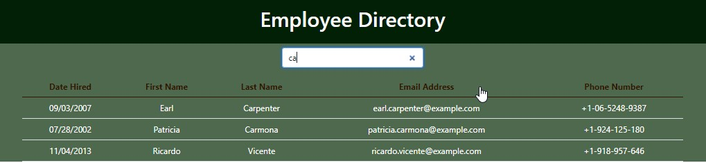

# Employee-Directory
By using the random user generator this application can pull up to 20 users, and also can help to filter and sort based on the requested input.

  * [Description](#description)
  * [Usage](#usage)
  * [Test](#test)
  * [Acknoledgment](#acknoledgment)
  * [Questions](#questions)

## Description
 
   This React application is an employee directory built for a manager to view non-sensitive information about their employees. It is front-end app with random user data being generated by the RandomUser API just for the purpose of learning the abilities of React.
    
  

## Usage 

You do not have a limitation to use this application. As you see the license section at the top of this file it is open source to use, copy, modify, and/or distribute this app for any purpose. 

  
## Test
  You can click on the following link and find non sensetive informations of employees.

  [Deploye lind](https://bayleyegn100.github.io/Employee-Directory/)
  
## Acknowledgement

My instructor, my tutor, online information providers like google, you tube and others.

## Question

If you have any questions you can reach me via [email](mailto:bayleyegn100@gmail.com).

Here is a link of my Github page: [Github](https://github.com/bayleyegn100)
